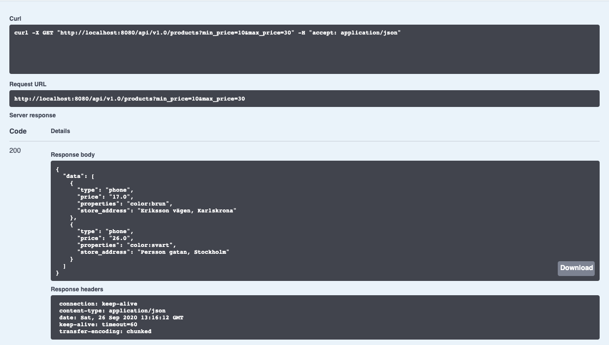
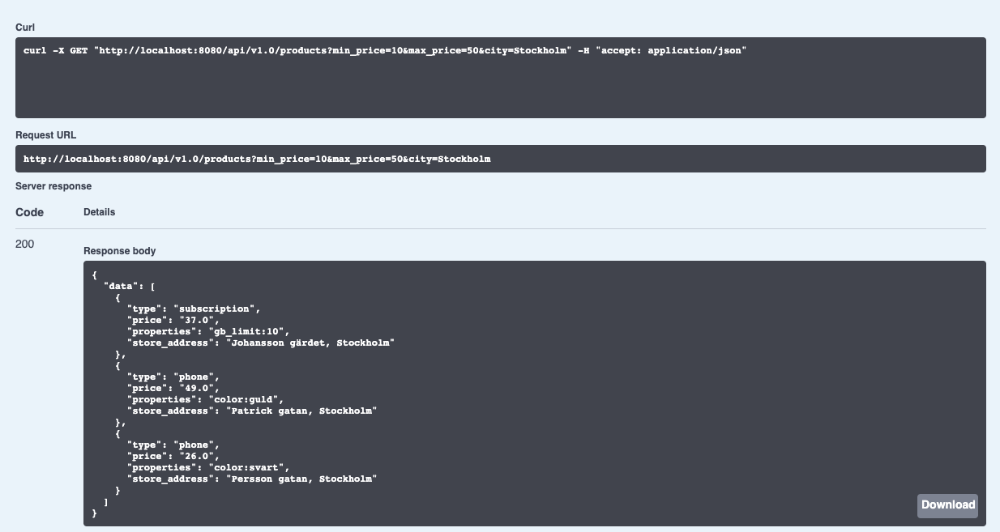
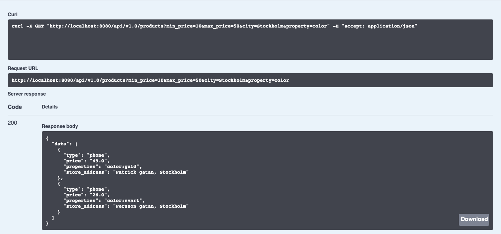
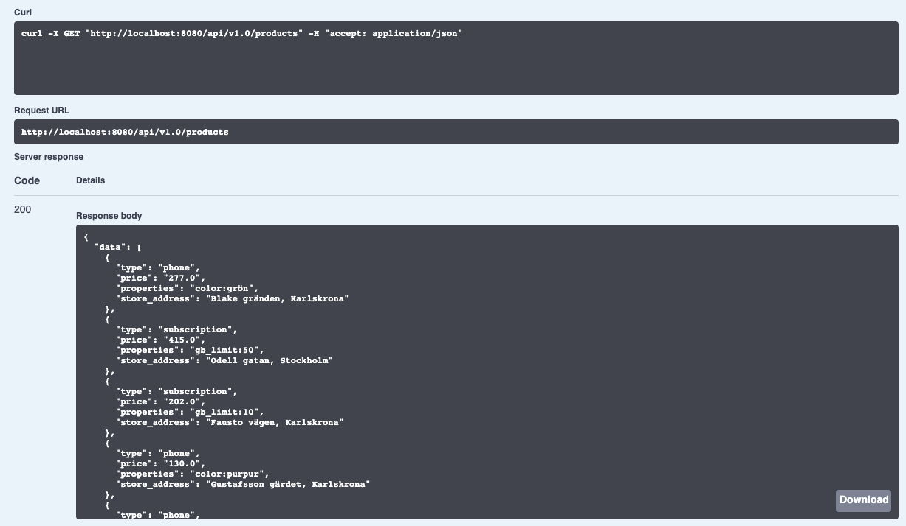

## Telenor's take-home assignment 'interview-apis'?
This source code is an Spring-Boot Application.
 
Tested with following
* Docker
* Java 8 or Java 11
* Spring-Boot 2.3.0.RELEASE
* Maven
* Swagger Open-API 3.0: for Rest APIs documentation and testing.
* Junit Tests
* data.csv file path: can be modifiable, just set the property 'custom.application.properties.local-csv-file-path' from application.properties project file. While this application can be testable with default date.csv file that located in this project's directory src/main/resources. 

## How to build and run this project?
```bash
// 1.a To build project and to run unit test-cases, run below maven command.
$ mvn clean install 

// 1.b (Optional) To run this project as spring-boot stand-alone application, using below command.
$ mvn spring-boot:run 

// 2. To create a docker image
$ sudo docker build . -t interview-apis

// 3. To run created docker image 
$ sudo docker run -p 8080:8080 interview-apis

// 4. Hit the URL below in browser to access the application. This will open the swagger document, 
// on this client you can test the end-point of the product.
$ http://localhost:8080
```


## GET /products REST-API tested samples:

API URL: http://localhost:8080/api/v1.0/products

```bash
// 1. API call sample using min_price and max_price as query parameters.
```


```bash
// 2. API call sample using min_price, max_price and city as query parameters.
```


```bash
// 3. API call sample using min_price, max_price, city and property as query parameters.
```


```bash
// 4. API call sample without query parameters.
```
